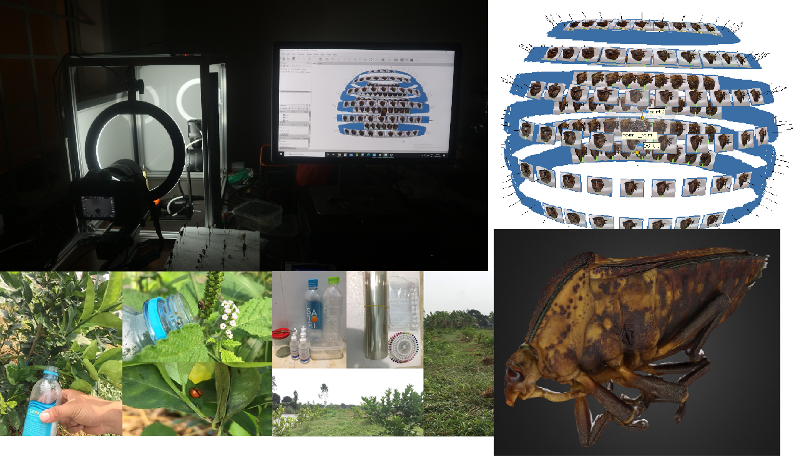
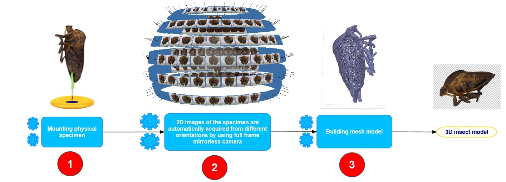
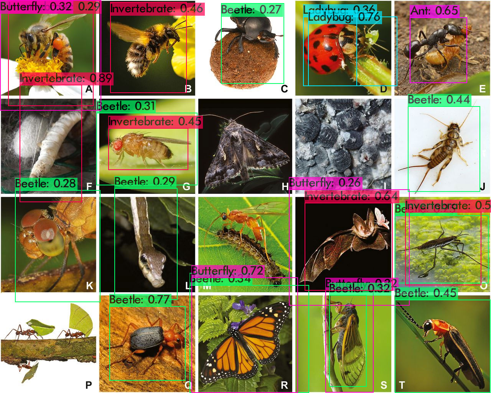
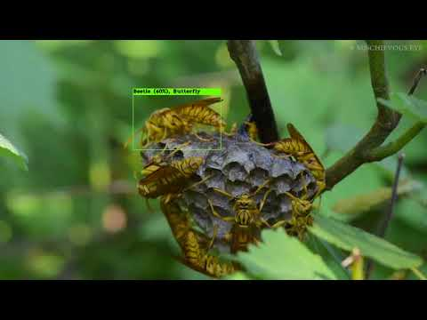

# Insect collection of Mekong Delta for sustainable agriculture, biodiversity discovery, and ecosystem education

[Thanh-Nghi Doan](https://github.com/dtnghigithub),
[Chuong V Nguyen](https://people.csiro.au/N/C/Chuong-Nguyen)<br>


**03/18/2021 update: Code and models released.** <br>

##  3D scanner for insect collections

[](https://www.youtube.com/watch?v=w36vnkIbyjs)

Insects play a significant role in our ecosystem and are the foundation of our food chain. Beneficial insects pollinate our crops, feed on harmful insects, and are a food source for other animals. On the other hand, insect pests harm beneficial insects, and damage crops and environment. Sustainable agriculture relies on proper insect management. The management of beneficial insects and pests require deep insight of their role and interactions in our ecosystem. To achieve this, we need useful tools to gain the necessary insights to inform our decision making. Recent advancements in computer vision, machine learning, and computing & imaging hardware allow us to capture more data, extract more useful information, and run more automatically and at a lower cost. The motivation of this project is to speed up this process in Vietnam by assembling relevant technologies and adapting/developing them to specific situations in Vietnam. Specifically, our goal is to build an insect data collection, which consists of pieces and images in Mekong Delta and develop a machine learning model that can automatically identify whether there is an insect in images taken by our camera system, and if so, what insects.

These are our 3D insect models in Sketchfab [link](https://sketchfab.com/dtnghiagu/models) 

## The three main steps to create a natural-colour 3D model of specimen
The steps are (1) mounting the physical insect onto a pin; (2) acquisition of 2D images of the specimen at different orientations (and focal depths for small
insects), this step marks the transition from the physical to the digital domain; then (3) reconstruction of a single 3D model from those multiple images.


## Insect classification and detection datasets
Insects play an important role in sustainable agricultural development. On the earth there are over 1 million insect species, of which, only 500 species are specialized in destroying crops and fruit trees, the rest are useful insects, they kill harmful insects, protect crops. Accurate identification of beneficial insects automatically helps minimize the use of pesticides, production costs, environmental pollution, and ensure ecological balance. However, the current image database of important insects in Vietnam for identification has not been systematically and large enough. This limits the development of advanced machine learning algorithms for entomology. In this paper, we present the construction of image large dataset of important insect species affecting agricultural production. Specifically, this dataset contains more than annotated 29,614 images in 204 different insect specimens. We have evaluated several state-of-the-art classification and detection algorithms on this dataset. Experimental results show that this dataset brings many challenges for the development of identification algorithms for insects, especially small insects, diverse and complex structures.

## Requirements
- Linux
- Python 3.7
- Pytorch 1.3.1
- NVIDIA GPU + CUDA CuDNN

## Getting started
### Clone the repository
```bash
git clone https://github.com/dtnghigithub/natgeo_insect.git
```
### Setting up the dataset

Download the classification dataset INSECT204 (4 GB), 204 classes, 29,614 images from this [link](https://drive.google.com/file/d/1b8ZSGedubZbV2zLmpR2nzjraW-49p0Z6/view?usp=sharing). 

Download the detection dataset INSECT10 (396 MB), 10 classes, 2706 images from this [link](https://drive.google.com/file/d/12WWAsUjo94wy-kJndDZyjAuuwO6aD_9z/view?usp=sharing). 

### Downloading pretrained classification models

Pretrained models for Achatina_fulica, Agrotis_ypslison are available at this [link](classification/models). 

## Evaluating the classification model
In `code`
- Run `python eval.py --z path_to_pose_source_images --b path_to_bg_source_images --p path_to_shape_source_images --c path_to_color_source_images --out path_to_ourput --mode code_or_feature --models path_to_pretrained_models`
- For example `python eval.py --z pose/pose-1.png --b background/background-1.png --p shape/shape-1.png --c color/color.png --mode code --models ../models  --out ./code-1.png`
  - **NOTE**:(1) in feature mode pose source images will be ignored; (2) Generator, Encoder and Feature_extractor in models folder should be named as G.pth, E.pth and EX.pth  
  
## Demo of Insect Object Counter Custom Function in Action!

## Downloading Official Pre-trained Weights
YOLOv4-pestdetection comes pre-trained and able to detect 22 classes. For easy demo purposes you can use the pre-trained weights yolov4-insectdetection_last.weights at this link https://drive.google.com/file/d/1QDaHKsejJS6XpDBfcNxPMfl_zDITF8x5/view?usp=sharing


## Training your own model
In `code/config.py`:
- Specify the dataset location in `DATA_DIR`.
  - **NOTE**: If you wish to train this on your own (different) dataset, please make sure it is formatted in a way similar to the CUB dataset that we've provided.
- Specify the number of super and fine-grained categories that you wish for FineGAN to discover, in `SUPER_CATEGORIES` and `FINE_GRAINED_CATEGORIES`.
- For the first stage training run `python train_first_stage.py output_name`
- For the second stage training run `python train_second_stage.py output_name path_to_pretrained_G path_to_pretrained_E`
  - **NOTE**:  output will be in `output/output_name`
  - **NOTE**:  `path_to_pretrained_G` will be  `output/output_name/Model/G_0.pth`
  - **NOTE**:  `path_to_pretrained_E` will be  `output/output_name/Model/E_0.pth`
- For example `python train_second_stage.py Second_stage ../output/output_name/Model/G_0.pth ../output/output_name/Model/E_0.pth`


## Results

### 1. The outputted image(s) showing the detections saved within the 'data' folder.

<br>

### 2. The output video(s) showing the detections here 
## [](https://youtu.be/ZoyBXzHBkWY)
[](https://youtu.be/ZoyBXzHBkWY)


### 3. Manipulating real images by varying a single factor

<br>

### 4. Inferring style from unseen data
Cartoon -> image             |  Sketch -> image
:-------------------------:|:-------------------------:
  |  
<br>

### 5. Converting a reference image according to a reference video
<p align="center">

</p>
<br>

## Citation
If you find this useful in your research, consider citing our work:
```
@inproceedings{li-cvpr2020,
  title = {MixNMatch: Multifactor Disentanglement and Encoding for Conditional Image Generation},
  author = {Yuheng Li and Krishna Kumar Singh and Utkarsh Ojha and Yong Jae Lee},
  booktitle = {CVPR},
  year = {2020}
}
```

