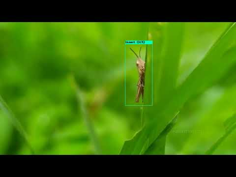

# Insect collection of Mekong Delta for sustainable agriculture, biodiversity discovery, and ecosystem education

[Thanh-Nghi Doan](https://github.com/dtnghigithub),
[Chuong V Nguyen](https://people.csiro.au/N/C/Chuong-Nguyen),
[Viet Phuong Le](https://dblp.org/pid/126/0907.html)<br>

**03/18/2021 update: Code and models released.** <br>

##  3D scanner for insect collections

[](https://youtu.be/Po0q_YQ-3EY)

Insects play a significant role in our ecosystem and are the foundation of our food chain. Beneficial insects pollinate our crops, feed on harmful insects, and are a food source for other animals. On the other hand, insect pests harm beneficial insects, and damage crops and environment. Sustainable agriculture relies on proper insect management. The management of beneficial insects and pests require deep insight of their role and interactions in our ecosystem. To achieve this, we need useful tools to gain the necessary insights to inform our decision making. Recent advancements in computer vision, machine learning, and computing & imaging hardware allow us to capture more data, extract more useful information, and run more automatically and at a lower cost. The motivation of this project is to speed up this process in Vietnam by assembling relevant technologies and adapting/developing them to specific situations in Vietnam. Specifically, our goal is to build an insect data collection, which consists of pieces and images in Mekong Delta and develop a machine learning model that can automatically identify whether there is an insect in images taken by our camera system, and if so, what insects. 

These are our 3D insect models in Sketchfab [link](https://sketchfab.com/dtnghiagu/models) 

## The three main steps to create a natural-colour 3D model of specimen
The steps are (1) mounting the physical insect onto a pin; (2) acquisition of 2D images of the specimen at different orientations (and focal depths for small
insects), this step marks the transition from the physical to the digital domain; then (3) reconstruction of a single 3D model from those multiple images.


## FieldWorks
We have collected insect samples from the Mekong Delta on-site suction traps and light traps monitoring for pest species currently around An Giang province. We also trained the students of the task of the sorting of samples sent from around the An Giang to monitor these pests. Once in the field, the student group traped and collect the bees, wasps, beetles, ants, lacewings, and stinkbugs whose brief but busy lives may influence how we create a sustainable future for bioenergy.


## Insect classification and detection datasets
Insects play an important role in sustainable agricultural development. On the earth there are over 1 million insect species, of which, only 500 species are specialized in destroying crops and fruit trees, the rest are useful insects, they kill harmful insects, protect crops. Accurate identification of beneficial insects automatically helps minimize the use of pesticides, production costs, environmental pollution, and ensure ecological balance. However, the current image database of important insects in Vietnam for identification has not been systematically and large enough. This limits the development of advanced machine learning algorithms for entomology. In this project, we present the construction of image large dataset of important insect species affecting agricultural production. Specifically, this dataset contains more than annotated 29,614 images in 204 different insect specimens. We have evaluated several state-of-the-art classification and detection algorithms on this dataset. Experimental results show that this dataset brings many challenges for the development of identification algorithms for insects, especially small insects, diverse and complex structures. 

Due to lack of knowledge of plant diseases and unavailability of expertise, farmers of rural areas can’t detect the insect effectively. Without recognizing insect, farmers use pesticides in excessive quantities, which can’t help in the prevention of disease, but can have malignant effects on plants. Therefore, an accurate identification has become essential to overcome this problem. For insect classification tasks, most of deep learning models employ the softmax activation function for prediction and minimize cross-entropy loss. In this project, we demonstrate a small but consistent advantage of replacing the softmax layer with a non-linear support vector machine Power Mean SVM. Learning minimizes a margin-based loss instead of the cross-entropy loss. By merging EfficientNet with Power Mean SVM, we have proposed a novel technique to insect picture categorization. The EfficientNet network model is then tweaked using the appropriate approach and retrained on the new data set. The network model that emerges is then utilized to extract picture characteristics from the dataset. The Power Mean SVM classifier replaces the softmax function in the image classification step. As a result, the learning process will be centered on decreasing margin-based loss rather than cross-entropy loss. The approach we presented has been tested on a large number of pest data sets. The results of our studies shown that our technique is more efficient and accurate than the best pest picture categorization methods currently available. On the Xie24 dataset, the accuracy of the model combining EfficientNet with Power Mean SVM is 99 percent, 99 percent on the D0 dataset, and 71.84 percent on the IP102 dataset. To the best of our knowledge, this is the best result available on these data sets.


<div align="center">
    <a href="https://wandb.ai/site?utm_campaign=repo_yolo_readme" rel="nofollow">
        
    </a>
    <a href="https://roboflow.com/?ref=ultralytics" rel="nofollow">
        
    </a>
</div>

## Requirements
- Linux
- Python 3.7
- Pytorch 1.3.1
- TensorFlow, Keras
- NVIDIA GPU + CUDA CuDNN

## Getting started
### Clone the repository
```bash
git clone https://github.com/dtnghigithub/natgeo_insect.git
```
### Download the insect dataset

Download the classification dataset INSECT204 (4 GB), 204 classes, 29,614 images from this [link](https://drive.google.com/file/d/1b8ZSGedubZbV2zLmpR2nzjraW-49p0Z6/view?usp=sharing). 

Download the detection dataset INSECT10 (396 MB), 10 classes, 2706 images from this [link](https://drive.google.com/file/d/12WWAsUjo94wy-kJndDZyjAuuwO6aD_9z/view?usp=sharing). 

All the annotations, up-to-date news, box visualization tools, etc. are available on the Open Insect Images website: http://luan-van.herokuapp.com/

### Downloading pretrained classification models

Pretrained models for Achatina_fulica, Agrotis_ypslison are available at this [link](classification/models). 

## Evaluating the classification model
In `code`
- Run `python eval.py --z path_to_pose_source_images --b path_to_bg_source_images --p path_to_shape_source_images --c path_to_color_source_images --out path_to_ourput --mode code_or_feature --models path_to_pretrained_models`
- For example `python eval.py --z pose/pose-1.png --b background/background-1.png --p shape/shape-1.png --c color/color.png --mode code --models ../models  --out ./code-1.png`
  - **NOTE**:(1) in feature mode pose source images will be ignored; (2) Generator, Encoder and Feature_extractor in models folder should be named as G.pth, E.pth and EX.pth  
  
## Demo of Insect Object Counter Custom Function in Action!


### Demo on YouTube 
[](https://youtu.be/Po0q_YQ-3EY)

## Downloading Official Pre-trained Weights
YOLOv4-pestdetection comes pre-trained and able to detect 22 classes. For easy demo purposes you can use the pre-trained weights yolov4-insectdetection_last.weights at this link https://drive.google.com/file/d/1QDaHKsejJS6XpDBfcNxPMfl_zDITF8x5/view?usp=sharing

## Training your own model
In `pyimagesearch/config.py`:
- Specify the dataset location in `ORIG_INPUT_DATASET`, initialize the path to the *original* input directory of images ORIG_INPUT_DATASET = "INSECT10"
- Initialize the base path to the *new* directory that will contain our images after computing the training and testing split, BASE_PATH = "dataset"
- Define the names of the training, testing, and validation directories: TRAIN = "training", TEST = "evaluation", VAL = "validation"
- initialize the list of class label names: CLASSES = ["Acalymma_vittatum", "Achatina_fulica", "Alticini", "Anasa_tristis", "Asparagus_beetles", "Aulacophora_similis", "Cerotoma_trifurcata", "Dermaptera", "Leptinotarsa_decemlineata", "Mantodea"]
- Set the batch size: BATCH_SIZE = 32
- For training run `python train_insect.py`

## Results

### 1. The outputted image(s) showing the detections saved within the 'data' folder.

<br>

### 2. The output video(s) showing the detections here 

[](https://youtu.be/ZoyBXzHBkWY)

## Citation
If you find this useful in your research, consider citing our work:
```
@inproceedings{nghi-vnict2021,
  title = {Building a new 3D insect scanner},
  author = {Thanh-Nghi Doan, Chuong V. Nguyen},
  booktitle = {VNICT},
  year = {2021}
}

@inproceedings{nghi-fair2021,
  title = {Insect image classification with EfficientNet and Power Mean SVM},
  author = {Thanh-Nghi Doan},
  booktitle = {FAIR},
  year = {2021}
}
```

